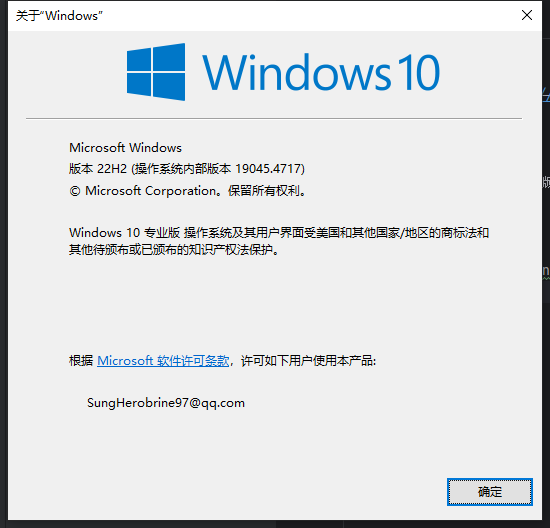
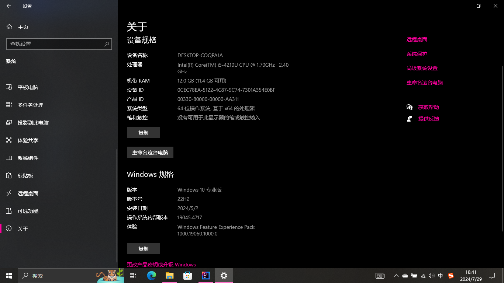
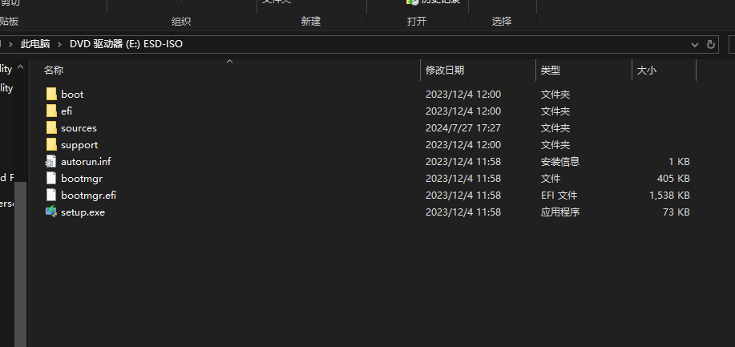
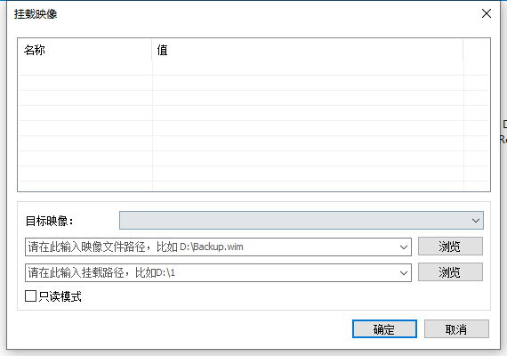
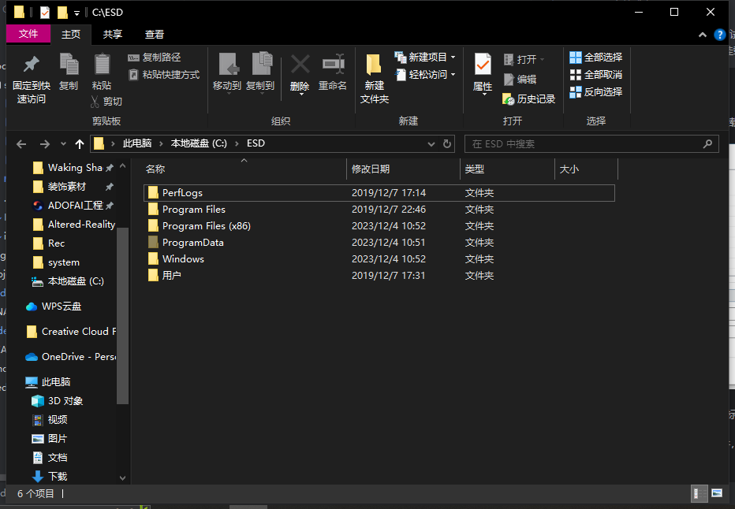

# 替换操作系统内的文件

~~本文基于[这个文章](https://www.bilibili.com/read/cv16431818)适当修改。~~（你这不废话吗，本文作者是MixerWangDev为什么还要这么写）

## 明确操作系统版本

有很多种办法可以确定操作系统的版本。

> [!TIP]
> 
> 如果你嫌这一大标题内容不相关，请跳过。（Win11请明确你的操作系统更新，否则替换的文件可能会无法运行。）
> 
> Win10最终支持的版本为22H2，如果你的版本为20H1请搜索“Win 10 20H1原版镜像”下载（**请勿下载二次封装的系统**）
> 
> 如果你不想搜索，你可以前往[这里](https://www.imsdn.cn/windows-10/)（22H2除外，但是可以去[微软官网](https://www.microsoft.com/zh-cn/software-download/windows10ISO)下载）

### winver命令

打开“运行”对话框，直接输入“winver”。



### 在“设置”>“系统”>“关于”查看



## 装载操作系统安装包来提取文件

### 使用dism.exe

> [!NOTE]
> 
> 建议安装UltraISO，鉴于Win10已经支持直接挂载iso文件，这里仅做提醒防止出现问题。

首先，找到对应原版的镜像（或者你从微软官网下载的镜像），双击装载（或者右键点击“装载”）。（镜像大小大约4-5GB）。

装载后如图。



然后以管理员身份运行命令提示符，运行指令。

```
dism /Mount-Image /ImageFile:C:\install.wim /Index:1 /ReadOnly /MountDir:<put your mount dir here>
```

将put your mount dir here替换为你想要挂载的目录（别带括号）。

> [!WARNING]
> 
> 警告！如果你看到D:/sources文件夹的一大堆文件，切勿惊慌。找install.esd文件或者install.wim
> 
> 切勿贸然装载esd文件，否则会遇到“试图加载格式不正确的程序。”的报错。此时接下来我们将使用dism++挂载。
> 参照这个[issue](https://github.com/Chuyu-Team/Dism-Multi-language/issues/245)

### 使用dism++手动操作

打开dism++，然后在“文件”菜单选择“挂载镜像”，如图。



按照提示选择映像路径、挂载路径和目标映像，点击确定。

如果还是报错，直接把esd转成wim文件，然后重新挂载（此时选择转换后的镜像，但转换过程消耗性能）。

成功挂载后如图。



## 提取文件

此处省略一些过程，我们直接导航到`Windows/system32/Drivers`文件夹开始拷贝文件到一个空白目录下（切勿拷贝到受保护的目录）。

提取之后卸载映像。执行`Dism /Unmount-Image /MountDir:<path_to_mount_directory> /Discard`或者回到dism++卸载。

## 开始替换

我们以null.sys为例，开始替换文件（进恢复环境就刑了）。
把提取的null.sys文件覆盖复制到`C:/Windows/system32/drivers`目录下，
回到操作系统。

## 检验成果

在管理员权限的命令提示符下，运行`sc query null`来检验成果。正确时会见到以下输出。

```
SERVICE_NAME: null
        TYPE               : 1  KERNEL_DRIVER
        STATE              : 4  RUNNING
                                (STOPPABLE, NOT_PAUSABLE, IGNORES_SHUTDOWN)
        WIN32_EXIT_CODE    : 0  (0x0)
        SERVICE_EXIT_CODE  : 0  (0x0)
        CHECKPOINT         : 0x0
        WAIT_HINT          : 0x0
```

## 参考以及需要用到的软件

本文的写成参考了这些文章和站点，感谢。

1. [WinRAR（可选）](https://winrar.com.cn)
2. [dism++ by Team Chuyu（初雨团队）](https://github.com/Chuyu-Team/Dism-Multi-language)
3. [DISM命令行选项](https://learn.microsoft.com/zh-cn/windows-hardware/manufacture/desktop/dism-image-management-command-line-options-s14)
4. [UltraISO（可选）](https://ultraiso.net/)
5. [原文](https://www.bilibili.com/read/cv16431818)