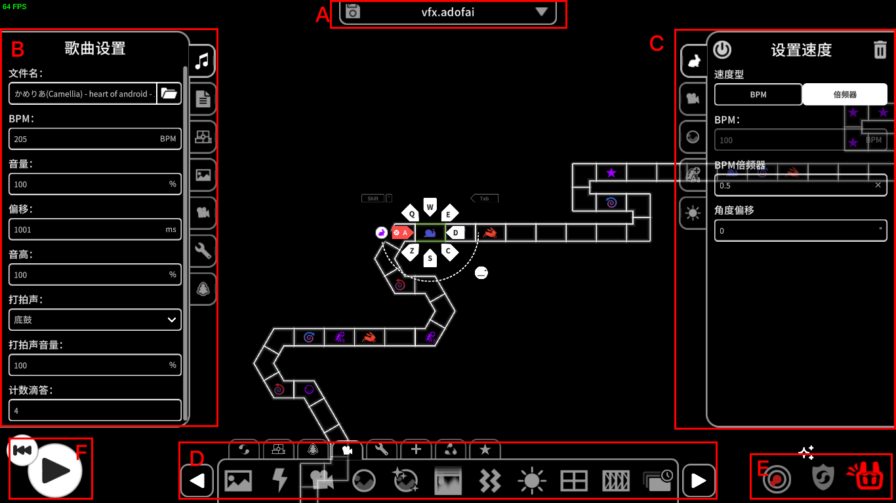

# 认识《冰与火之舞》关卡编辑器的UI



如图所示，上图是《冰与火之舞》关卡编辑器（下称ADOFAI谱面编辑器）的UI，六个区域用红框标注。

接下来我们以字母顺序来讲一下这些区域的作用。

A: 这个区域显示了文件名称（如果没有打开任何一个谱面则显示“关卡未保存。”），点击此处会显示新建/打开/保存选项。

> 如果想重启编辑器，请点击此处并点击“门”图标，然后重新进入编辑器。（除非谱师明确要求，否则千万不要Alt-F4）
>
> 冷知识：按住Ctrl时点击此处会打开谱面所在的文件夹。

B: 此处按标签分别为曲目、谱面信息、轨道、背景、摄像头、杂项、装饰管理。

其中，曲目会影响你的谱面在TUF论坛的评级。

谱面信息可填可不填（除非你想传工坊），里面包括了曲师（编辑器写的是艺术家）、曲名、谱师（编辑器写的是关卡作者）、描述、难度、癫痫警告（需要注意），这些条目。

当你把信息填完之后，你就可以传工坊了（**别忘了把授权证明附上编辑器内可以上传，不然到时候被DMCA你就老实了**）。

代码示例如下：

```JSON
{
    "settings":
    {
		"version": 15 ,
		"artist": "Camellia", 
		"specialArtistType": "None", 
		"artistPermission": "", 
		"song": "Tojita Sekai", 
		"author": "MixerWangDev", 
		"separateCountdownTime": true, 
		"previewImage": "", 
		"previewIcon": "", 
		"previewIconColor": "003f52", 
		"previewSongStart": 0, 
		"previewSongDuration": 10, 
		"seizureWarning": false, 
		"levelDesc": "", 
		"levelTags": "", 
		"artistLinks": "", 
		"speedTrialAim": 0, 
		"difficulty": 1, 
		"requiredMods": [],
		"songFilename": "かめりあ(Camellia) - heart of android - 11 Tojita Sekai.ogg", 
		"bpm": 205, 
		"volume": 100, 
		"offset": 1001, 
		"pitch": 100
        // 此处省略一部分，只是为了展示效果。
    }
} 
```

装饰部分后文再开一个章节说。

C: 你在选中的选中的一个轨道（不是多个）时会显示事件属性。

D: 点击可添加事件。这里不再多说，我们默认你已熟悉所有事件的用途（轨道、装饰、视觉特效还能拓展一下）。

E: 判定、不死模式、奥拓普雷（Autoplay）。

F: “看到大圆了吗？点他！” 播放谱面。

## 快捷键

### 多数软件通用（不排除你某个按键恰好坏了。）

* Ctrl-O 打开
* Ctrl-S 保存
* Ctrl-Shift-S 另存为
* Alt-F4 关闭窗口
* Ctrl-A 全选
* Ctrl-Z 撤销
* Ctrl-Shift-Z 重做
* Ctrl-C Ctrl-X Ctrl-V 复制、剪切、粘贴
* Ctrl-N 新建项目

### 仅冰与火之舞（按键逻辑是写死的）

此处仅展示3个常用的快捷键、其他操作可以按下Ctrl-H查看。

* Ctrl-Shift-V 粘贴你复制的的事件
* Ctrl-Shift-C 复制选中的事件
* Ctrl-Alt-C 一键复制所有相同的事件
