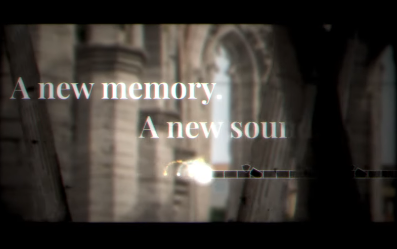
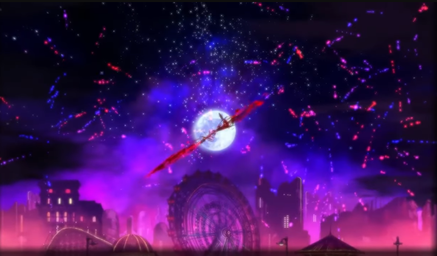

# ADOFAI 谱师可以做什么视觉特效

在 A Dance of Fire and Ice (ADOFAI) 中，谱师可以通过以下几种方式来创建视觉特效：

1. **背景变化**：谱师可以设置不同的背景图片或颜色，并在特定的时间点进行切换，以增强视觉效果。

2. **轨道颜色**：谱师可以改变轨道的颜色，使其与音乐的节奏和情感相匹配。

3. **相机移动**：通过调整相机的移动路径和速度，谱师可以创造出动态的视觉效果，使玩家的体验更加丰富。

4. **特效动画**：谱师可以添加各种动画效果，如闪烁、旋转、缩放等，以增加视觉冲击力。

5. **粒子效果**：通过添加粒子效果，如烟雾、火花等，谱师可以进一步增强视觉表现力。

6. 还有......甚至可以

[Waking Shadows - Sad keyboard Guy & eili & Gardens CDF 2023 with ADOFAI.gg](https://www.youtube.com/watch?v=Z-twyB5vDjs)

[CICADA3302 - Camellia](https://www.youtube.com/watch?v=ct5KSzsIsMo)

Hero - Mili(But not ADOFAI)